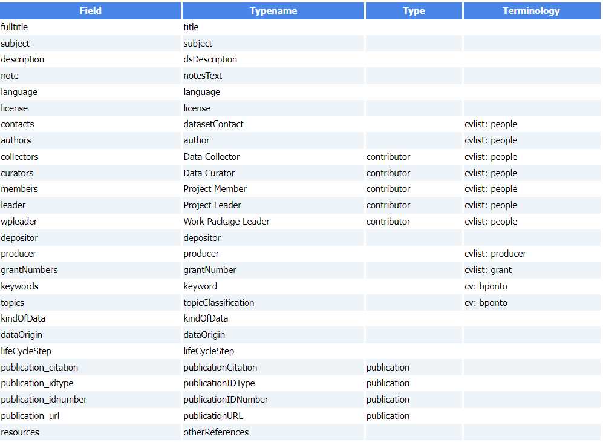

 

---

* **Dataverse definition File**
     * Example of Dataverse JSON file generated based on the definition file itself given as an example below.
		  * [Dataverse JSON of the FRIM dataset][1]{:target="_blank"}
     * Below an example of Dataverse definition file (TSV)

 

[1]: https://pmb-bordeaux.fr/maggot/metadata/frim1?format=dataverse

