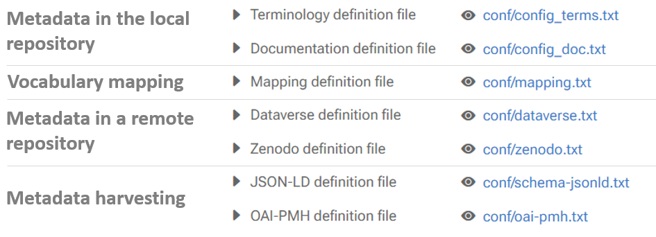

### Configuration flexibility

The Maggot tool offers [great flexibility in configuration][6]{:target="_blank"}. It allows you to completely choose all the metadata you want to describe your data. You can base yourself on an existing [metadata schema][1]{:target="_blank"}, invent [your own schema][2]{:target="_blank"}[^1] or, more pragmatically, mix one or more schemas by introducing some metadata specific to your field of application. However, keep in mind that if you want to add descriptive metadata to your data then a [certain amount of information][3]{:target="_blank"} is expected. But a completely different use of the tool is possible, it's up to you.

The list of definition files in Maggot are given below. All must be put under the directory *[web/conf][4]{:target="_blank"}*.

 

There are two categories of definition files:

**1** - The first category concerns the definition of terminology (metadata + controlled vocabulary). Clearly, this category is more akin to application configuration files. They represent the heart of the application around which everything else is based. The input and search interfaces are completely generated from these definition files (especially the *[web/conf/config_terms.txt](../definitions/terminology)* file), thus defining each of the fields, their input type (checkbox, dropbox, textbox, ...) and the associated controlled vocabulary (ontology and thesaurus by autocompletion, drop-down list according to a list of fixed terms). This is why a [configuration and conversion step](../configuration) into JSON format is essential in order to be able to configure all the other modules.

**2** - The second category concerns the definitions of mapping to a differently structured metadata schema (e.g. [Dataverse](dataverse), [JSON-LD](json-ld), [OAI-PMH](oai-pmh)). Simply place the definition files in the configuration directory (*[web/conf][4]{:target="_blank"}*) for them to be taken into account, provided you have adjusted the configuration (*[web/inc/config/config.inc][5]{:target="_blank"}*).

All definition files are made using a simple spreadsheet then exported in TSV[^2] format. 

 

[^1]: *How to create a descriptive metadata plan*:  https://sustainableheritagenetwork.org/system/files/atoms/file/How_to_Create_a_Descriptive_Metadata_Plan.pdf
[^2]: *TSV*: open text format representing tabular data as "tab-separated values". Each row corresponds to a table row and the cells in a row are separated by a tab.

[1]: https://en.wikipedia.org/wiki/Metadata_standard
[2]: https://committee.iso.org/files/live/sites/tc46sc11/files/documents/N800R1%20Where%20to%20start-advice%20on%20creating%20a%20metadata%20schema.pdf
[3]: https://libraries.mit.edu/data-management/store/documentation/
[4]: https://github.com/inrae/pgd-mmdt/tree/main/web/conf
[5]: https://github.com/inrae/pgd-mmdt/blob/main/web/inc/config/config.inc
[6]: https://inrae.github.io/pgd-mmdt/pdf/MAGGOT_OpenData_Oct2023.pdf?download=false
