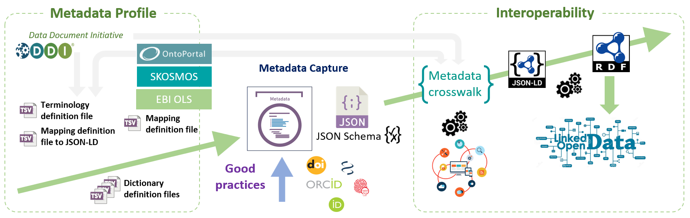
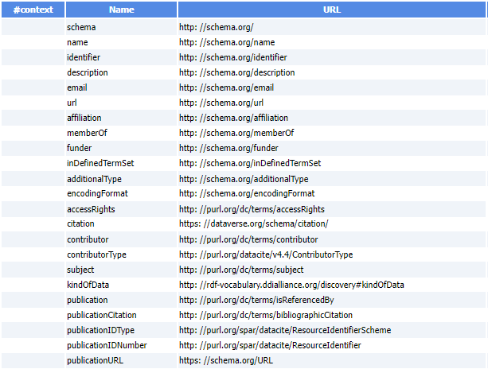
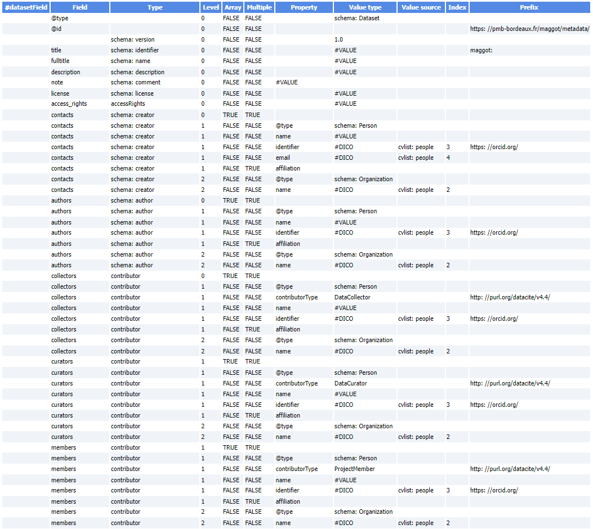
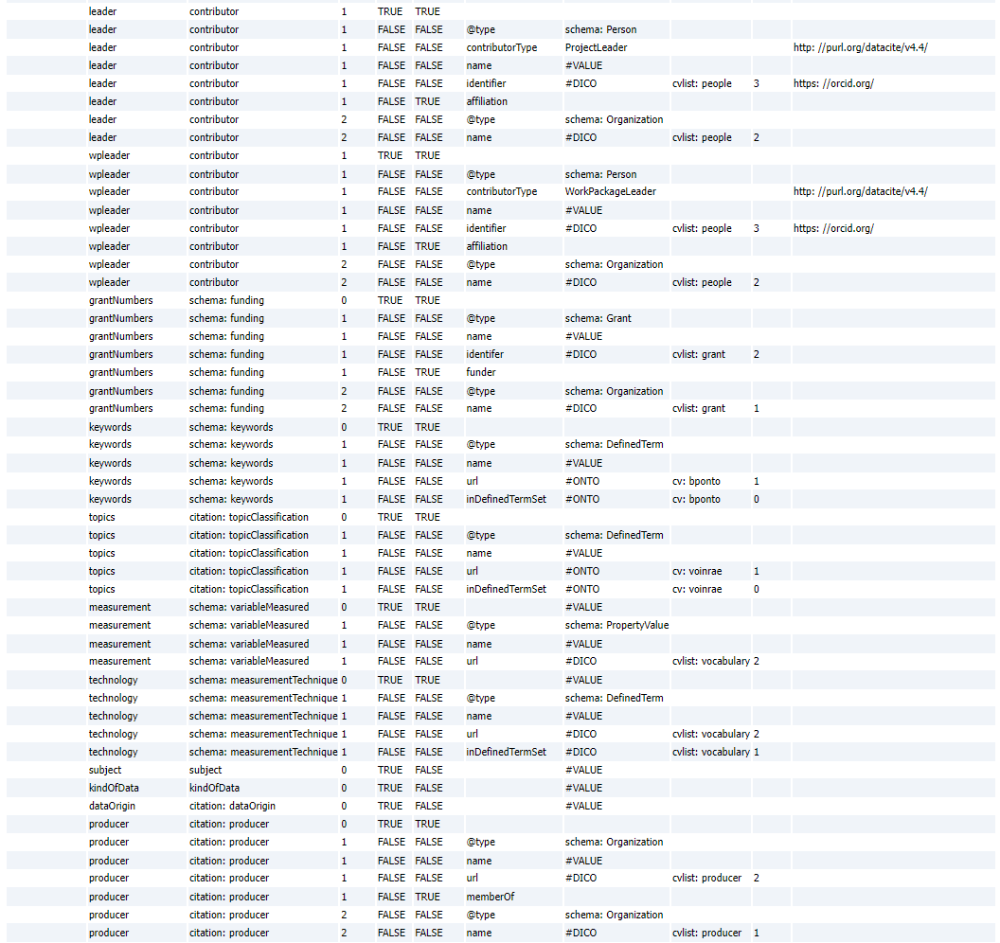
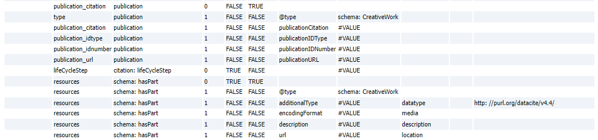

 

---

* **JSON-LD definition File**

	 * Metadata schemas used to build the model proposed by default:
		  * [Schema.org][2]{:target="_blank"}, [Bioschemas.org][3]{:target="_blank"}, [Datacite][4]{:target="_blank"}, [DDI-RDF][5]{:target="_blank"}, [DubinCore][6]{:target="_blank"}, [Dataverse][7]{:target="_blank"}
     * Example of JSON-LD file generated based on the definition file itself given as an example below.
 		  * [JSON-LD file of the FRIM dataset][1]{:target="_blank"}
     * Below an example of JSON-LD definition file (TSV)

 

[1]: https://pmb-bordeaux.fr/maggot/metadata/frim1?format=jsonld
[2]: https://schema.org/Dataset
[3]: https://bioschemas.org/profiles/Dataset/1.0-RELEASE
[4]: https://support.datacite.org/docs/datacite-metadata-schema-44
[5]: https://rdf-vocabulary.ddialliance.org/discovery.html
[6]: https://www.dublincore.org/specifications/dublin-core/dcmi-terms/
[7]: https://docs.google.com/spreadsheets/d/13HP-jI_cwLDHBetn9UKTREPJ_F4iHdAvhjmlvmYdSSw/edit#gid=0