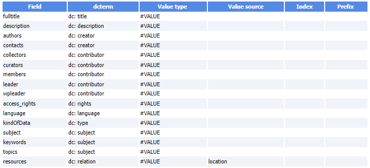
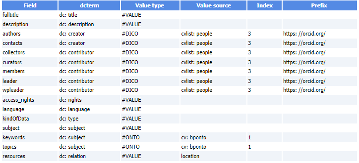

 

---

* **OAI-PMH definition File**
     * Based on the [Open Archives Initiative Protocol for Metadata Harvesting][1]{:target="_blank"} - [Version 2][2]{:target="_blank"}
	 * Example of a [OAI-PMH Data Provider Validation][4]{:target="_blank"}
     * Example of OAI-PMH output for a dataset
		  * [FRIM dataset][3]{:target="_blank"}
     * Example of OAI-PMH definition file (TSV)

     * Another example of OAI-PMH definition file (TSV) with identifers & vocabulary mapping

[1]: https://en.wikipedia.org/wiki/Open_Archives_Initiative_Protocol_for_Metadata_Harvesting
[2]: https://www.openarchives.org/OAI/openarchivesprotocol.html
[3]: https://pmb-bordeaux.fr/maggot/oai?verb=GetRecord&metadataPrefix=oai_dc&identifier=oai:pmb-bordeaux.fr::frim1
[4]: ../../pdf/MAGGOT_OAI-PMH_Validation_Oct2023.pdf
