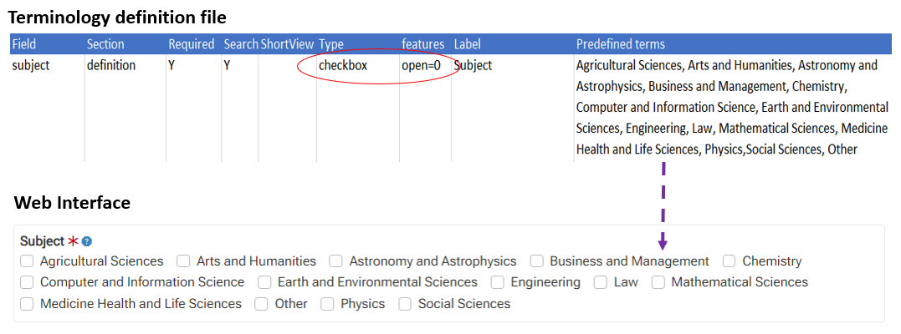
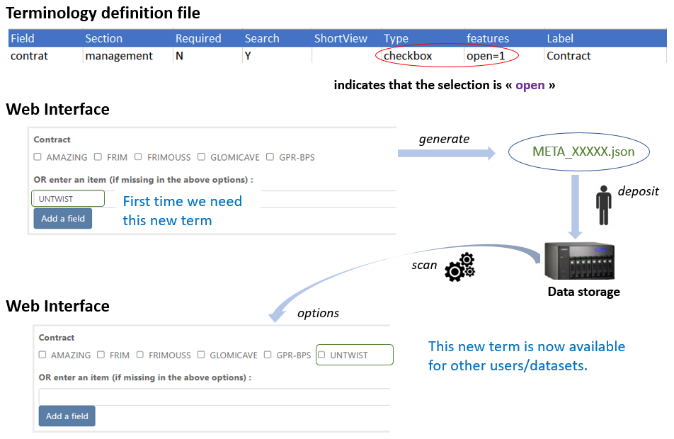
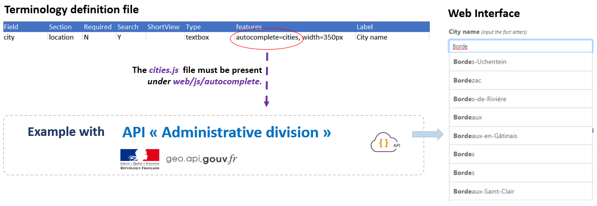
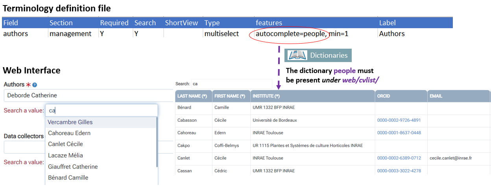
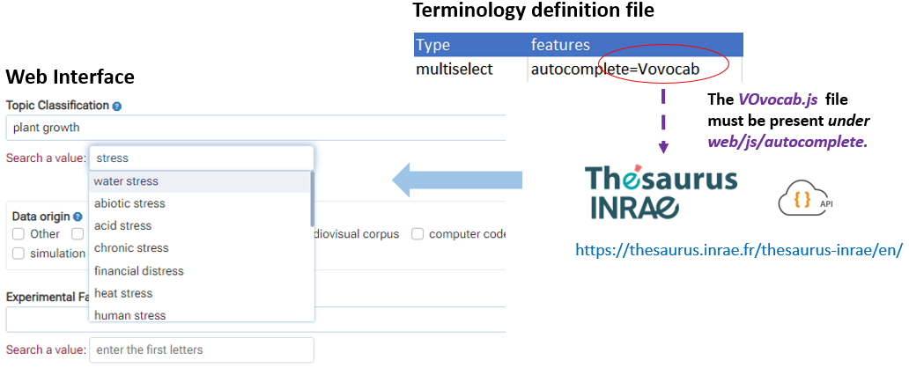
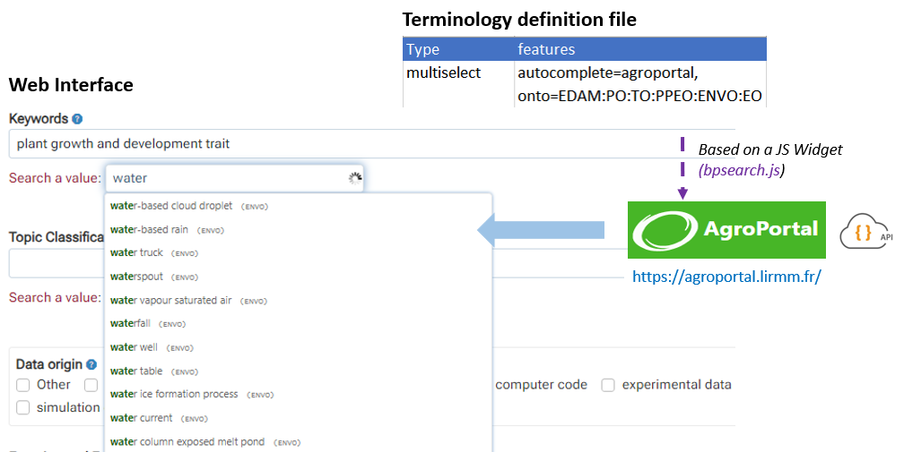

### Vocabulary

* In this section we expose the full extent of the possibilities concerning the vocabulary in Maggot.
* Choosing the type of vocabulary and how to enter it depends entirely on what you put in the [terminology definition file](../terminology). However, some approaches require a little technicality by writing small scripts based on [JavaScript][13]{:target="_blank"}, but nothing too serious. You can always take an already ready-made script and modify only the part that concerns your focus.

 

**1** -  **Vocabulary based on a list of terms fixed in advance** (*checbox with feature open=0*)

* List of well-chosen and limited Control Vocabulary e.g according to a reference e.g. Data Document Initiative.

 

**2** - **Vocabulary open for addition** (*checkbox with feature open=1*)

* allows you to collect the desired _Control Vocabulary_ (CV) from users. In order to initiate the list, you can put some terms in the _predefined terms_ column of the terminology definition file.

 

**3** - **Vocabulary based on a web API in a text field** (*textbox*)

* The [web API][1]{:target="_blank"} is defined in a [JavaScript][13]{:target="_blank"} file with the same name as the assigned variable (here *cities*) and must present under *web/js/autocomplete*. For example, to enter a French city you can use the API [geo.api.gouv.fr][3]{:target="_blank"}. See [cities.js][4]{:target="_blank"}

 

**4** - **Vocabulary based on a dictionary with multiple selection** (*multiselect*) 

* [Dictionaries](../../dictionaries) allow you to record multiple information necessary to define an entity, such as the names of people or even the funders. These information, once entered and saved in a file called a dictionary. Based on a very simple JavaScript retrieving the complete list of items included in the dictionary, thus creating a sort of internal API, we can fill a Maggot field by  autocompletion related to a search for these items.
* The JavaScript file must be named _**dico.js**_ and be present under _**web/cvlist/_dico_/**_ where _**dico**_ is the name of the dictionary. See for instance _[people.js][5]{:target="_blank"}_

 

**5** - **Vocabulary based on a SKOSMOS Thesaurus with multiple selection** (*multiselect*) 

* [SKOSMOS][6]{:target="_blank"} is a web tool facilitating the posting of controlled vocabulary online in the form of a [thesaurus][9]{:target="_blank"} according to the [SKOS][8]{:target="_blank"} data model. It offers a navigation interface as well as a web API. A simple JavaScript allows you to easily connect this web API with a multiselect field.
* The JavaScript file must have the same name as the assigned variable (here _VOvocab_) and must present under _web/js/autocomplete_. See for instance [VOvocab.js][10]{:target="_blank"}.

 

**6** - **Vocabulary based on an OntoPortal with multiple selection** (*multiselect*) 

* Portals based on [OntoPortal][7]{:target="_blank"} offer the wealth of ontologies according to several domains of application (e.g. [BioPortal][11]{:target="_blank"} in the biomedical domain, [AgroPortal][12]{:target="_blank"} in the domain of plants).
* No need of JavaScript file. The [Bioportal Autocompletion widget][14]{:target="_blank"} has been [implemented into Maggot][15]{:target="_blank"}. You have to only declare the ontology you want to use directly into the terminology definition file in order to easily connect this widget with a multiselect field.

 

 

*[API]: Application Program Interface in contrast with a User Interface. It is a way for two or more computer programs to communicate with each other. 

[1]: https://en.wikipedia.org/wiki/Web_API
[2]: https://en.wikipedia.org/wiki/Autocomplete
[3]: https://geo.api.gouv.fr/decoupage-administratif
[4]: https://github.com/inrae/pgd-mmdt/blob/main/web/js/autocomplete/cities.js
[5]: https://github.com/inrae/pgd-mmdt/tree/main/web/cvlist/people/people.js
[6]: https://skosmos.org/
[7]: https://ontoportal.org/
[8]: https://en.wikipedia.org/wiki/Simple_Knowledge_Organization_System
[9]: https://en.wikipedia.org/wiki/Thesaurus_(information_retrieval)
[10]: https://github.com/inrae/pgd-mmdt/blob/main/web/js/autocomplete/VOvocab.js
[11]: https://bioportal.bioontology.org/
[12]: https://agroportal.lirmm.fr/
[13]: https://en.wikipedia.org/wiki/JavaScript
[14]: https://bioportal.bioontology.org/ontologies/STY?p=widgets
[15]: https://github.com/inrae/pgd-mmdt/blob/main/web/js/bpsearch.min.js
