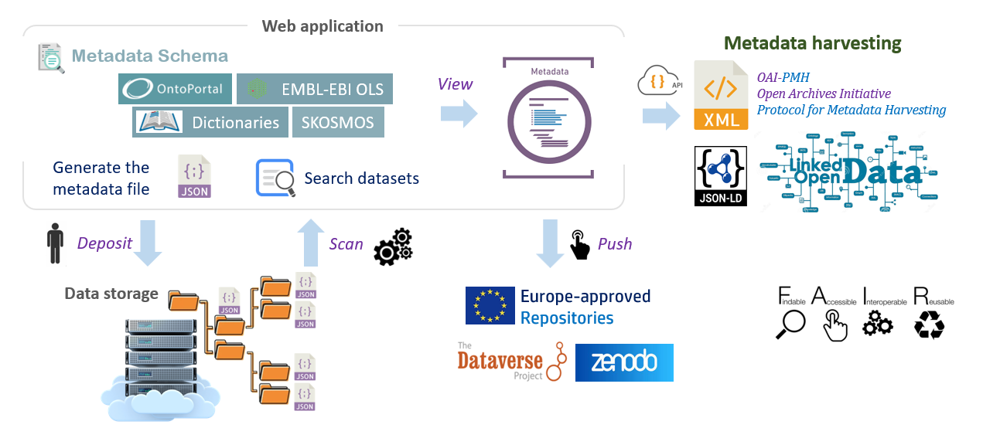

 

Foster good data management, with "data sharing” in mind

 Sharing descriptive metadata is the first essential step towards the so-called “Open Data” approach. With this in mind, the Maggot tool was specially designed to allow users to easily add descriptive metadata to datasets produced within a collective (research unit, platform, multi-partner project, etc.), thus promoting the sharing of metadata within this same collective and beyond.

---

[][10]{:target="_blank"}

[1]: https://bio.tools/ODAM
[2]: https://hal.inrae.fr/hal-03335186
[3]: https://en.wikipedia.org/wiki/Metadata
[10]: https://www.inrae.fr/en

