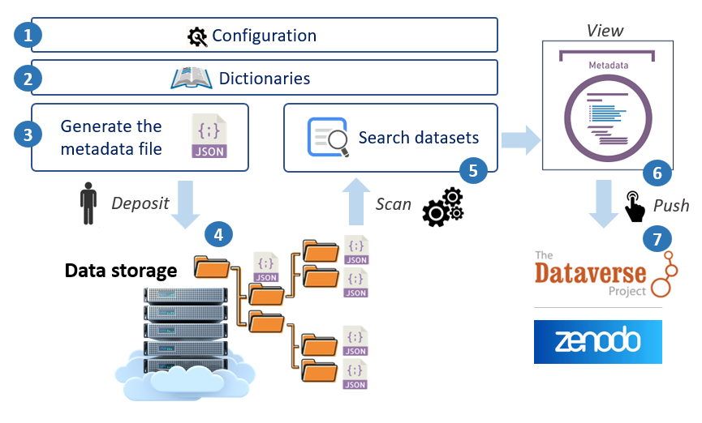

### Main features of Maggot

1. Documente with [Metadata][3]{:target="_blank"} your datasets produced within a collective of people, thus making it possible :
	* to answer <a href="../images/DMP_fig.png" data-lightbox="fig8">certain questions</a> of the [Data Management Plan (DMP)][4]{:target="_blank"} concerning the organization, documentation, storage and sharing of data in the data storage space, 
	* to meet certain data and metadata requirements, listed for example by the [Open Research Europe][5]{:target="_blank"} in accordance with the [FAIR principles][7]{:target="_blank"}.
2. Search datasets by their metadata
    * Indeed, the descriptive metadata thus produced can be associated with the corresponding data directly in the storage space then it is possible to perform a search on the metadata in order to find one or more sets of data. Only descriptive metadata is accessible by default.
3. Publish the metadata of datasets along with their data files into an [Europe-approved repository][8]{:target="_blank"}

_See a short [Presentation][11]{:target="_blank"} and [Poster][12]{:target="_blank"} for a quick overview_.

### Overview of the different stages of metadata management

 
**_Note:_**  _The step numbers indicated in the figure correspond to the different points developed below_

**1** - First you must define all the [metadata][3]{:target="_blank"} that will be used to describe your datasets.
<a href="javaScript:;" class="extra-js extra-show-js">&nbsp;&nbsp; :octicons-chevron-down-16:</a>
It is possible to define all the metadata using a single file (in TSV format, therefore using a spreadsheet). The metadata proposed by default was mainly established according to the [DDI][9]{:target="_blank"} (Data Documentation Initiative) [metadata schema][10]{:target="_blank"}. This schema also largely corresponds to that adopted by the [Dataverse][16]{:target="_blank"} software. This is a primordial step because both input and search interfaces are completely generated from these definition files, defining in this way each of the fields, their input type (*checkbox*, *dropbox*, *textbox*, ...) and also the associated Controlled Vocabulary ([ontology][18]{:target="_blank"} and [thesaurus][19]{:target="_blank"} by autocompletion, drop-down list according to a list of fixed terms). See the [Terminology Definition](../definitions/terminology) section.
<a href="javaScript:;" class="extra-js-2 extra-hide-js">&nbsp; :octicons-chevron-up-16: </a>

**2** - Entering metadata will be greatly facilitated by the use of [dictionaries](../dictionaries).
<a href="javaScript:;" class="extra-js extra-show-js">&nbsp;&nbsp; :octicons-chevron-down-16:</a>
The dictionaries offered by default are: *people*, *funders*, *data producers*, as well as a *vocabulary* dictionary allowing you to mix ontologies and thesauri from several sources. Each of these dictionaries allows you to enter a name or a main title by autocompletion. Then the information associated with it will be added during export (data deposit, JSON-LD format, OAI-PMH).
<a href="javaScript:;" class="extra-js-2 extra-hide-js">&nbsp; :octicons-chevron-up-16: </a>

**3** - The web interface for entering metadata is entirely built on the basis of [definition files](../definitions/). 
<a href="javaScript:;" class="extra-js extra-show-js">&nbsp;&nbsp; :octicons-chevron-down-16:</a>
The metadata is thus distributed according to the different sections chosen, each constituting a tab. Mandatory fields are marked with a red star and must be documented in order to be able to generate the metadata file (see <a href="../images/entry_fig.png" data-lightbox="fig1">screenshot 1</a> & <a href="../images/entry_fig2.png" data-lightbox="fig5">screenshot 2</a>). The entry of metadata governed by a controlled vocabulary (<i>dictionary, thesaurus or ontology</i>) is done by autocompletion. Once the mandatory fields (at least) and other recommended fields (the best) have been entered, the metadata file can be generated in JSON format.
<a href="javaScript:;" class="extra-js-2 extra-hide-js">&nbsp; :octicons-chevron-up-16: </a>

**4** - The file generated in JSON format must be placed in the [storage space](../infrastructure) reserved for this purpose. 
<a href="javaScript:;" class="extra-js extra-show-js">&nbsp;&nbsp; :octicons-chevron-down-16:</a>
The role played by this metadata file can be seen as a README file adapted for machines, but also readable by humans. With an internal structure, it offers coherence and consistency of information that a simple README file with a completely free and therefore unstructured text format does not allow. Furthermore, the central idea is to use the storage space as a local data repository, so that the metadata should go to the data and not the other way around. If the <a href="../images/filebrowser_fig1.png" data-lightbox="fig8">filebrowser</a> application is installed, then you can directly access the data space according to your access rights. See on [github][15]{:target="_blank"}.
<a href="javaScript:;" class="extra-js-2 extra-hide-js">&nbsp; :octicons-chevron-up-16: </a>

**5** - A search of the datasets can thus be carried out on the basis of the metadata. 
<a href="javaScript:;" class="extra-js extra-show-js">&nbsp;&nbsp; :octicons-chevron-down-16:</a>
Indeed, all the JSON metadata files are scanned and parsed according to a fixed period ([30 min][20]{:target="_blank"}) then loaded into a [MongoDB][21]{:target="_blank"} database. This allows you to perform searches based on predefined metadata. The search form, in its compact shape on the left of the screen, is almost the same as the entry form (see a <a href="../images/search_fig.png" data-lightbox="fig6">screenshot</a>). Depending on the search criteria, a list of data sets is provided, with for each of them a link pointing to the detailed sheet.
<a href="javaScript:;" class="extra-js-2 extra-hide-js">&nbsp; :octicons-chevron-up-16: </a>

**6** - The detailed metadata sheet provides all the metadata divided by section. 
<a href="javaScript:;" class="extra-js extra-show-js">&nbsp;&nbsp; :octicons-chevron-down-16:</a>Unfilled metadata does not appear by default. When a URL can be associated with information (ORCID, Ontology, web site, etc.), you can click on it to go to the corresponding link. Likewise, it is possible to follow the associated link on each of the resources. From this sheet, you can also export the metadata according to different schemata (Dataverse, Zenodo, JSON-LD). See <a href="../images/metadata_fig0.png" data-lightbox="fig7">screenshot 1</a> & <a href="../images/metadata_fig1.png" data-lightbox="fig4">screenshot 2</a>.
<a href="javaScript:;" class="extra-js-2 extra-hide-js">&nbsp; :octicons-chevron-up-16: </a>

**7** - Finally, once you have decided to [publish your metadata](../publish) with your data, you can choose the repository 
<a href="javaScript:;" class="extra-js extra-show-js">&nbsp;&nbsp; :octicons-chevron-down-16:</a>that suits you (currently repositories based on [Dataverse][16]{:target="_blank"} and [Zenodo][17]{:target="_blank"} are supported).
<a href="javaScript:;" class="extra-js-2 extra-hide-js">&nbsp; :octicons-chevron-up-16: </a>

  

*[TSV]: Open text format representing tabular data as "Tab-Separated Values". Each row corresponds to a table row and the cells in a row are separated by a tab
*[JSON]: JavaScript Object Notation : format used to represent structured information
*[autocompletion]: feature in which an application predicts the rest of a word a user is typing

[3]: https://en.wikipedia.org/wiki/Metadata
[4]: https://en.wikipedia.org/wiki/Data_management_plan
[5]: https://open-research-europe.ec.europa.eu/for-authors/data-guidelines
[6]: https://www.ouvrirlascience.fr/second-national-plan-for-open-science/
[7]: https://open-research-europe.ec.europa.eu/for-authors/data-guidelines#fairdata
[8]: https://open-research-europe.ec.europa.eu/for-authors/data-guidelines#approvedrepositories
[9]: https://ddialliance.org/
[10]: https://en.wikipedia.org/wiki/Metadata_standard
[11]:  https://inrae.github.io/pgd-mmdt/pdf/MAGGOT_Metadata_Oct2023.pdf?download=false
[12]:  https://inrae.github.io/pgd-mmdt/pdf/MAGGOT_Poster_Oct2023.pdf?download=false
[13]: https://pmb-bordeaux.fr/maggot/entry
[14]: https://pmb-bordeaux.fr/maggot/search
[15]: https://github.com/djacob65/maggot-fb
[16]: https://dataverse.org/
[17]: https://www.openaire.eu/zenodo-guide
[18]: https://en.wikipedia.org/wiki/Ontology_(information_science)
[19]: https://en.wikipedia.org/wiki/Thesaurus_(information_retrieval)
[20]: https://github.com/inrae/pgd-mmdt/blob/main/dockerscanpart/scripts/pgd-cron
[21]: https://www.mongodb.com/basics
